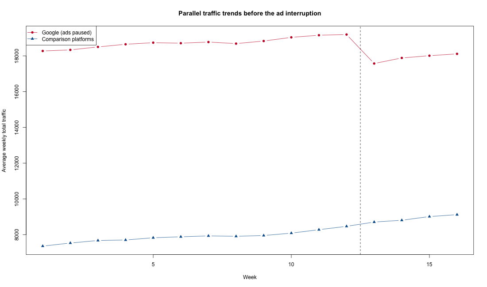
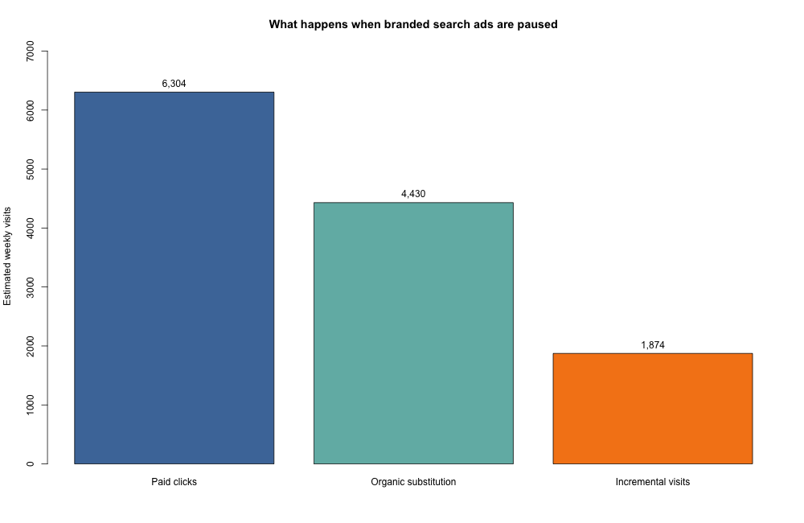

# Sponsored Search Incrementality Analysis

An R-based Difference-in-Differences analysis of how much branded paid-search traffic is genuinely incremental—and how much would arrive through organic search anyway.

## Business question

A standard paid-search report attributes every sponsored click to advertising. That logic can overstate performance for branded keywords because many users are already searching for the company and may simply choose the organic result when the ad is unavailable.

I used an interruption in one platform's sponsored ads as a natural experiment. The analysis compares the affected platform with three uninterrupted platforms before and after the outage to answer two questions:

1. How many paid clicks disappear completely when the ads stop?
2. How many move to the free organic result instead?

## Analytical design

The public version uses a deterministic synthetic dataset with the same panel structure as my coursework analysis:

- 16 weeks of organic and sponsored traffic
- one treated search platform where ads stop in Week 13
- three comparison platforms where advertising continues
- parallel pre-intervention trends
- partial substitution from sponsored to organic traffic after the interruption

I estimate the treatment effect separately for total, organic, and sponsored traffic using:

- a standard Difference-in-Differences model;
- platform and week fixed effects;
- a pre-period slope check; and
- a placebo intervention before the real outage.

Estimating all three traffic outcomes creates a useful accounting check:

```text
counterfactual paid clicks = organic substitution + incremental visits
```

## Results from the synthetic case

| Measure | Estimated weekly volume |
|---|---:|
| Paid clicks expected without the outage | 6,304 |
| Clicks shifting to organic search | 4,431 |
| Genuinely incremental visits | 1,874 |
| Incremental share of paid clicks | 29.7% |

The naive calculation treats all 6,304 paid clicks as incremental and reports a **320% ROI**. After crediting the campaign with only the traffic identified by the DiD estimate, ROI falls to approximately **24.8%**.

This does not mean branded search is automatically unprofitable. It shows why channel decisions should be based on incremental traffic rather than platform-attributed clicks.





## Run the project

The analysis uses base R and does not require additional packages.

```bash
Rscript R/generate_data.R
Rscript R/did_analysis.R
Rscript R/test_analysis.R
```

Generated outputs:

- `outputs/did_effects.csv`
- `outputs/pretrend_check.csv`
- `outputs/placebo_check.csv`
- `outputs/traffic_decomposition.csv`
- `outputs/roi_comparison.csv`
- `outputs/parallel_trends.png`
- `outputs/traffic_decomposition.png`

## Repository structure

```text
R/generate_data.R       Reproducible synthetic panel-data generator
R/did_analysis.R        DiD models, diagnostics, decomposition, and ROI
R/test_analysis.R       Checks for effect direction and accounting consistency
data/                   Synthetic input data and provenance notes
outputs/                Model estimates, diagnostics, and charts
```

## Interpretation boundary

The dataset is synthetic, so its estimates demonstrate the method rather than provide evidence about a real campaign. A production analysis would also require enough treated and comparison units for defensible inference, credible parallel trends, no treatment-specific concurrent shocks, and a clear definition of conversion value and media cost.

## Coursework context

This project originated in an MSBA 6441 causal-inference assignment on sponsored-search incrementality. I rewrote the public version around generated data, modular R functions, reproducible outputs, and automated checks. Original case observations, instructions, and submission files are not included.
